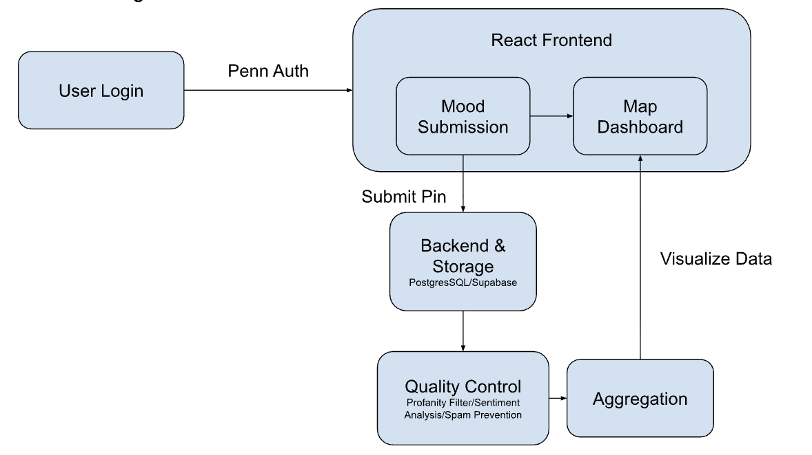

# Final Project Proposal: MoodMap@Penn

**Team Name**: MoodMap@Penn
**Submission Date**: November 13, 2025
**GitHub Organization**: https://github.com/MoodMap-Team4 

---

## Team Information

### Team Members

| Name | PennKey | Primary Role(s) | Secondary Skills |
|------|---------|----------------|------------------|
| Tiffany Lian | tilian | Frontend (React Native), Figma Design, Backend Dev, Databases | ML|
| Arriella Mafuta | arriella | Frontend (React Native), Figma Design, Backend Dev, Databases | ML |
| Mario Valek | mvalek| Python, Data Analysis, User Recruitment| R, Visualization, statistics |
| Veda Mantena | vmantena | Python, Aggregation, Data Analysis, User Recruitment | [e.g., ML, statistics] |

### Team Skills Inventory

**Skills we have:**
- Backend Design: Tiffany Lian/tilian, Arriella Mafuta/arriella
- Data analysis & statistics: Mario Valek/mvalek, Veda Mantena/vmantena
- Frontend Design: Tiffany Lian/tilian, Arriella Mafuta/arriella
- User research & recruitment: Mario Valek/mvalek

**Skills we need to learn/acquire:**
- Map API Integration: Geolocation for Mood Pins - Arriella
- React: To build website - Tiffany Lian/tilian, Arriella Mafuta/arriella
- Penn Authentication: Part of Quality Control - Tiffany Lian/tilian

**External resources we might need:**
- [Resource 1]: [e.g., Specific API access, dataset, tool] - [Status: requested/pending/acquired]
- [Resource 2]: [e.g., Paid service credits] - [Status and cost estimate]

### Team Availability for TA Meetings

**Week of [Date]:**

_List all time slots when the ENTIRE team can meet with a TA. Use Eastern Time. Format: Day, Time-Time_

Tiffany
- Monday: 6:00 PM - 11:59 PM
- Tuesday: 5:00 PM - 11:59 PM
- Wednesday: 6:00 PM - 11:59 PM
- Thursday: 5:00 PM - 11:59 PM
- Friday: 2:00 PM - 8:00 PM

Arriella 
- Monday: 6:00 PM - 11:59 PM
- Tuesday: 6:00 PM - 11:59 PM
- Wednesday: 6:00 PM - 11:59 PM
- Thursday: 6:30 PM - 11:59 PM
- Friday: 6:00 PM - 8:00 PM

Veda
- Monday: 5:00 PM - 11:59 PM
- Tuesday: 3:30 PM - 11:59 PM
- Wednesday: 5:00 PM - 11:59 PM
- Thursday: 3:30 PM - 11:59 PM
- Friday: 4:30 PM - 9:00 PM

Mario
- Monday: 2:00 PM - 5:00 PM
- Tuesday: 8:30PM - 11:59 PM
- Wednesday: 2:00 PM - 11:59 PM
- Thursday: 8:30PM - 11:59 PM
- Friday: 8:00PM - 11:59 PM


**Common Availability across all 4 members:**
- Wednesday: 6:00 PM - 11:59 PM ET
- Friday: 6:00 PM - 8:00 PM ET


**Preferred meeting duration**: [30 min / 45 min / 60 min]
30-45 min
**Meeting format preference**: [In-person / Zoom / Either]
Zoom
**Primary contact for scheduling**: [Name and email]
mvalek@sas.upenn.edu
---

## Project Overview

### Project Connection to Round 4

**Round 4 Decision**: STAYING

**Original idea from**: 
Original Author: Tiffany Lian (tilian)
Round 2 Contributors: Arriella Mafuta (arriella)
Round 3 Contributors: Veda Mantena (vmantena)

**How the idea evolved**: 
_Briefly describe how your project changed from its original conception through Rounds 1-4 to this final proposal_

The project evolved from a broad campus-wide mood mapping platform to a focused MVP targeting specific Penn communities. We narrowed the scope to ensure feasibility while maintaining the core value proposition. The emotional categories were refined to 5 specific options, and we prioritized privacy and safety measures based on feedback.

### Problem Statement

_Refined from your Round 4 decision_

Penn students often struggle with high stress, burnout, and the social pressure to appear fine even when they are not. This culture, known as “Penn Face,” leads many to hide their emotions behind a sense of constant achievement and composure. MoodMap@Penn addresses this by allowing students to anonymously share how they are actually feeling, revealing that they are not alone and helping build a more open, supportive campus community.

### One-Sentence Pitch

MoodMap@Penn crowdsources anonymous mood pins from Penn students and visualizes campus well-being on an interactive map to build a more open, supportive campus community.

### Target Users

**End Users**: Penn students who want to check in with their own mood and see how their environment compares to peers. Instructors and student leaders (e.g., NETS 2130 staff, RAs) who want a high-level sense of how their groups are feeling over time.

**Crowd Workers**: The same Penn students acting as contributors by submitting mood pins and short reflections.  

**Scale**: ~40 unique student contributors each submitting 3-5 mood pins/week

### Project Type

- [ ] Human computation algorithm
- [x] Social science experiment with the crowd
- [ ] Tool for crowdsourcing (requesters or workers)
- [ ] Business idea using crowdsourcing
- [ ] Other: [specify]

---

## System Architecture

### Flow Diagram



**If you haven't created it yet**: Describe in words the major components and their relationships:

1. User should login with their Penn emails and we should be able to send them a verification code/link to their email from our backend, then they will be brough to the pin submission page. Only once they submit a pin can they view the Map data. In the backend, the pin will be stored in our database, bad submissions will be filtered out, the data will be aggregated, then visualized in the dashboard.

### Major System Components

_List all major components with point values (1-4) indicating implementation complexity. Total should be 15-20 points._

| Component | Description | Points | Owner(s) | Dependencies |
|-----------|-------------|--------|----------|--------------|
| PennAuth Login & Verification | Penn email login flow: collects user email, sends verification code/link, validates token, and gates access so only authenticated users can reach the Mood Submission page. | 3 | Tiffany, Arriella | User schema finalized; backend email service configured |
| Mood Submission UI (React Frontend) | Authenticated-only React screen that collects mood, intensity, location, and optional text; upon first successful submit, unlocks access to the Map Dashboard. | 4 | Tiffany, Arriella | PennAuth login working; mood/location schema defined; API endpoints ready |
| Backend & Storage (Supabase/Postgres) | API endpoints that receive submitted pins, store them in Postgres, and expose data for QC and aggregation. | 4 | Tiffany | Finalized database schema; Supabase project set up |
| Quality Control Module | Filters out invalid or low-quality submissions (profanity, missing fields, spam patterns), marks pins as accepted/rejected for downstream aggregation. | 3 | Mario | Backend storing raw pins with consistent schema |
| Aggregation & Dashboard Visualization | Computes location/time-based summaries from QC-accepted pins and powers the Map Dashboard view. | 3 | Veda, Tiffany | QC output available; backend export or endpoint for aggregates |

**Total Points**: 17

**Point allocation rationale**: 
PennAuth login and email verification is moderately complex (3) because it requires integrating an external auth flow and email delivery but is bounded in scope. The mood submission UI and backend/storage are core, full-stack components (4 each) that must be robust and handle real user traffic. QC and aggregation/visualization (3 each) involve non-trivial logic and data pipelines but build on top of the stored data and existing frontend, keeping overall complexity in the 15–20 range.

### Detailed Workflow

_Step-by-step description of how your system works from start to finish_

### Detailed Workflow

1. **User authentication (PennAuth login)**:  
   The user enters their Penn email in the login screen. The frontend sends this to the backend, which generates and emails a verification code or link.

2. **Verification + session creation**:  
   The user clicks the verification link or enters the code. The backend validates it, creates an authenticated session, and the frontend routes the user to the Mood Submission page. The Map Dashboard remains locked.

3. **Submit mood pin**:  
   On the Mood Submission page, the user selects their mood, intensity, location bucket, and an optional note. The React frontend sends this pin data to the backend API.

4. **Store raw pin in database**:  
   The backend stores the pin in the Postgres/Supabase database along with timestamp and user/session metadata.

5. **Run quality control**:  
   The QC module loads newly submitted pins, filters out invalid or low-quality submissions (e.g., missing fields, profanity, spam-like patterns), and marks records as accepted or rejected.

6. **Aggregate cleaned data**:  
   The aggregation module processes QC-accepted pins, grouping them by location and time window, producing summary statistics and writing aggregated results to an aggregates table/export.

7. **Visualize aggregated mood data**:  
   After a user submits at least one valid pin, they unlock the Map Dashboard. The React frontend fetches aggregated QC-filtered data and displays it via the map and charts.

### Human vs. Automated Tasks

### Human vs. Automated Tasks

| Task | Performed By | Justification |
|------|--------------|---------------|
| Submitting a mood pin (mood, intensity, location, optional text) | Human | Only users can accurately self-report their current emotional state and contextual information. |
| Storing pins and managing user authentication sessions | Automated | These are repeatable, rule-based operations handled reliably by backend systems. |
| Writing optional text notes that describe context | Human | Free-form reflection requires human cognition and cannot be generated meaningfully by automation. |
| Quality control filtering and aggregation (field checks, spam detection, grouping by location/time) | Automated | These follow defined rules, scale better when automated, and ensure consistent processing of large numbers of submissions. |

---

## Quality Control Module

### QC Strategy Overview

Our quality control approach combines automated filtering with human oversight. Given the sensitive nature of emotional data and potential for misuse, we prioritize safety while preserving authenticity. Automated filters handle clear violations, while ambiguous cases are flagged for human review.

Primary mechanism: Automated content filtering with human review queue

### Specific QC Mechanisms

**Primary mechanism**: [e.g., Gold standard questions, Majority voting, Expert review]

**Implementation details:**
- Input format: User-submitted text + metadata
- Processing: Profanity filter, sentiment analysis, spam pattern detection
- Output format: Approved/Flagged/Rejected status with confidence score
- Threshold for acceptance: 90% confidence for auto-approval
**Additional mechanisms:**
- Profanity filter with custom campus-specific dictionary
- Rate limiting (5 pins/day per user)
- Location validation (must be on campus)
- Report system for users to flag concerning content
- Admin moderation dashboard for flagged content

### QC Module Code Plan

**Location in repo**: [e.g., `src/qc/quality_control.py`]

**Key functions/classes**:
ProfanityFilter: Text content screening
SpamDetector: Pattern analysis for abuse
ContentModerator: Main QC orchestration
FlaggedContentQueue: Human review management


**Input data format**: 
```
{
  "user_id": "string",
  "location": {"lat": float, "lng": float},
  "emotion": "string",
  "text": "string",
  "timestamp": "ISO8601"
}

```

**Output data format**:
```
{
  "pin_id": "string",
  "status": "approved|flagged|rejected",
  "confidence": float,
  "flags": ["array_of_violations"],
  "moderator_notes": "string"
}
```

**Sample scenario**:
_Walk through a concrete example of your QC module in action_

User submits a pin with text 'so stressed about finals'. Profanity filter passes, sentiment analysis detects stress but no violations, system auto-approves with 95% confidence. Another user submits repetitive identical pins within minutes, spam detector flags for rate limiting violation."

---

## Aggregation Module

### Aggregation Strategy Overview

Our aggregation approach focuses on spatial and temporal patterns in mood data. We analyze emotional distributions across campus locations and time periods to identify trends and hotspots. The system weights recent data more heavily and clusters nearby pins to prevent map clutter.

### Aggregation Method

**Primary method**: Spatial clustering with temporal weighting

**Implementation details**:
- Input format: Approved mood pins with metadata
- Processing: DBSCAN clustering, time-based weighting, emotion distribution analysis
- Output format: Aggregated mood clusters with dominant emotions
- Handling edge cases: Minimum cluster size = 3 pins, fallback to individual pins


**Why this method**:
Spatial clustering naturally groups nearby emotional expressions while temporal weighting ensures relevance. This approach balances detail with readability on the map interface.

### Aggregation Module Code Plan

**Location in repo**: [e.g., `src/aggregation/aggregate.py`]

**Key functions/classes**:
1. [Function/class name]: [Purpose]
2. [Function/class name]: [Purpose]
3. [Function/class name]: [Purpose]

**Input data format**:
```
[Describe or show example of input data structure]
```

**Output data format**:
```
[Describe or show example of output data structure]
```

**Sample scenario**:
_Walk through a concrete example of your aggregation module in action_

[Example: "10 workers rate restaurant review sentiment. Scores: 7 positive, 2 negative, 1 neutral. Aggregation weights by worker reliability scores, outputs 0.82 positive sentiment with confidence interval."]

### Integration: QC ↔ Aggregation

**How do these modules interact?**
[Describe the relationship. Does QC happen before aggregation? After? Iteratively? Do they share data structures?]

**Data flow diagram** (if different from main flow diagram):
[Location or description]

---

## User Interface & Mockups

### Interfaces Required

_You need mockups for ALL user-facing interfaces_

**For Crowd Workers:**
- [ ] Task interface / HIT design
- [ ] Instructions page
- [ ] Training/qualification interface (if applicable)

**For End Users:**
- [ ] Main interface
- [ ] Results display
- [ ] Any configuration/input screens

**For Administrators (your team):**
- [ ] Dashboard/monitoring
- [ ] Data management interface

### Mockup Details

**Mockup location**: [e.g., `docs/mockups/` folder or links to Figma/Marvel/etc.]

**For each interface, describe**:

#### Interface 1: [Name]
- **User type**: [Crowd worker / End user / Admin]
- **Purpose**: [What is this interface for?]
- **Key elements**: [What must be visible/interactive?]
- **Mockup file**: [filename or link]
- **Notes**: [Any important design decisions or requirements]

#### Interface 2: [Name]
- **User type**: [Crowd worker / End user / Admin]
- **Purpose**: [What is this interface for?]
- **Key elements**: [What must be visible/interactive?]
- **Mockup file**: [filename or link]
- **Notes**: [Any important design decisions or requirements]

_Continue for all interfaces..._

### Task Design (for crowd workers)

**If using MTurk or similar platform:**

**HIT title**: [Your HIT title]

**HIT description**: [What workers will see in the HIT listing]

**Task instructions**: 
_Write the actual instructions workers will see. Be specific and clear._

[Your instructions here]

**Example task**:
[Show workers exactly what one complete task looks like]

**Estimated time per task**: [X minutes]

**Payment per task**: $[amount]

**Number of tasks per HIT**: [number]

**Qualifications required**: [e.g., >95% approval rate, >100 HITs, US location]

---

## Technical Stack

### Technologies

**Frontend**: [e.g., React, Vue, vanilla JS, none (MTurk only)]

**Backend**: [e.g., Python/Flask, Node.js/Express, Django]

**Database**: [e.g., PostgreSQL, MongoDB, Firebase, SQLite]

**Crowdsourcing Platform**: [e.g., MTurk, custom, social media, class volunteers]

**ML/AI Tools** (if applicable): [e.g., scikit-learn, TensorFlow, OpenAI API]

**Hosting/Deployment**: [e.g., Heroku, AWS, Vercel, local]

**Other tools**: [Any other important tools or services]

### Repository Structure

**Current structure**:
```
your-repo/
├── README.md
├── docs/
│   ├── flow-diagram.pdf
│   ├── mockups/
│   └── ...
├── src/
│   ├── qc/
│   ├── aggregation/
│   └── ...
├── data/
│   ├── raw/
│   ├── sample-qc-input/
│   ├── sample-qc-output/
│   ├── sample-agg-input/
│   └── sample-agg-output/
└── ...
```

**Explain any deviations**: [If your structure differs, explain why]

---

## Data Management

### Input Data

**Source**: [Where will your input data come from?]

**Format**: [File type, structure, schema]

**Sample data location**: `data/raw/` 

**Sample data description**:
[Describe what sample data you've gathered and what it represents]

**How much data do you need?**
- For testing/development: [amount]
- For your final demo/analysis: [amount]

**Data collection plan**:
[How and when will you gather the full dataset?]

### QC Module Data

**Input location**: `data/sample-qc-input/`

**Input format**:
```
[Show example structure - can be JSON, CSV, etc.]
```

**Output location**: `data/sample-qc-output/`

**Output format**:
```
[Show example structure]
```

**Sample scenario documentation**:
[In your data/ directory, include a README explaining the sample QC data]

### Aggregation Module Data

**Input location**: `data/sample-agg-input/`

**Input format**:
```
[Show example structure]
```

**Output location**: `data/sample-agg-output/`

**Output format**:
```
[Show example structure]
```

**Sample scenario documentation**:
[In your data/ directory, include a README explaining the sample aggregation data]

### Data Dependencies

**Does your QC module output feed into your aggregation module?**
[Yes/No and explain the relationship]

**Data flow between modules**:
[Describe how data moves through your system]

---

## Crowd Recruitment & Management

### Recruitment Strategy

**Where will workers come from?**
[Be specific: MTurk? Class volunteers? Social media? Where exactly?]

**How will you reach them?**
[Describe your recruitment approach]

**When will you recruit?**
[Timeline for recruitment activities]

### Worker Incentives

**Compensation model**: 
- Payment per task: $[amount]
- Estimated time per task: [X minutes]
- Effective hourly rate: $[amount/hour]

**Or alternative incentive**: [e.g., course credit, gamification, intrinsic motivation]

**Justification**: [Why this incentive structure will work]

### Scale Requirements

**For MVP/Demo**:
- Minimum workers needed: [number]
- Minimum tasks completed: [number]
- Timeline: [when you need this by]

**For Full Analysis**:
- Target workers: [number]
- Target tasks: [number]
- Timeline: [when you need this by]

### Backup Plan

**If recruitment fails or is insufficient**:
- [ ] Use MTurk/paid workers (budget: $[amount])
- [ ] Simplify task to require fewer workers
- [ ] Use simulated/synthetic data
- [ ] Other: [specify]

---

## Project Milestones & Timeline

### Week-by-Week Plan

**Week 1 (Dates: [X/X - X/X])**
- Milestone: [Major goal for this week]
- Tasks:
  - [ ] [Specific task] - [Owner]
  - [ ] [Specific task] - [Owner]
  - [ ] [Specific task] - [Owner]
- Deliverable: [What will be done/ready by end of week]

**Week 2 (Dates: [X/X - X/X])**
- Milestone: [Major goal for this week]
- Tasks:
  - [ ] [Specific task] - [Owner]
  - [ ] [Specific task] - [Owner]
  - [ ] [Specific task] - [Owner]
- Deliverable: [What will be done/ready by end of week]

**Week 3 (Dates: [X/X - X/X])**
- Milestone: [Major goal for this week]
- Tasks:
  - [ ] [Specific task] - [Owner]
  - [ ] [Specific task] - [Owner]
  - [ ] [Specific task] - [Owner]
- Deliverable: [What will be done/ready by end of week]

**Week 4 (Dates: [X/X - X/X])**
- Milestone: [Major goal for this week]
- Tasks:
  - [ ] [Specific task] - [Owner]
  - [ ] [Specific task] - [Owner]
  - [ ] [Specific task] - [Owner]
- Deliverable: [What will be done/ready by end of week]

_Continue through your full timeline..._

### Critical Path

**Blocking dependencies** (what MUST be done before other work can proceed):
1. [Task A] must be done before [Task B, Task C]
2. [Task X] must be done before [Task Y]

**Parallel work** (what can be done simultaneously):
- [Person 1] can work on [X] while [Person 2] works on [Y]

**Integration points** (when pieces must come together):
- [Date]: [What components must integrate]
- [Date]: [What components must integrate]

---

## Risk Management

### Technical Risks

**Risk 1**: [Describe technical challenge/uncertainty]
- **Likelihood**: [Low / Medium / High]
- **Impact**: [Low / Medium / High]
- **Mitigation**: [How you'll prevent or address it]
- **Backup plan**: [What you'll do if mitigation fails]

**Risk 2**: [Describe technical challenge/uncertainty]
- **Likelihood**: [Low / Medium / High]
- **Impact**: [Low / Medium / High]
- **Mitigation**: [How you'll prevent or address it]
- **Backup plan**: [What you'll do if mitigation fails]

### Crowd-Related Risks

**Risk 1**: [e.g., Can't recruit enough workers]
- **Likelihood**: [Low / Medium / High]
- **Impact**: [Low / Medium / High]
- **Mitigation**: [How you'll prevent or address it]
- **Backup plan**: [What you'll do if mitigation fails]

**Risk 2**: [e.g., Low quality contributions]
- **Likelihood**: [Low / Medium / High]
- **Impact**: [Low / Medium / High]
- **Mitigation**: [How you'll prevent or address it]
- **Backup plan**: [What you'll do if mitigation fails]

### Resource Risks

**Risk 1**: [e.g., Budget overrun]
- **Likelihood**: [Low / Medium / High]
- **Impact**: [Low / Medium / High]
- **Mitigation**: [How you'll prevent or address it]
- **Backup plan**: [What you'll do if mitigation fails]

---

## Evaluation Plan

### What You'll Measure

**Primary metrics**:
1. [Metric 1]: [How measured, target value]
2. [Metric 2]: [How measured, target value]
3. [Metric 3]: [How measured, target value]

**Secondary metrics**:
1. [Metric 1]: [How measured]
2. [Metric 2]: [How measured]

### Analysis Approach

**What questions will your analysis answer?**
1. [Research question 1]
2. [Research question 2]
3. [Research question 3]

**What comparisons will you make?**
- [ ] Compare crowd vs. expert performance
- [ ] Compare crowd vs. automated baseline
- [ ] Compare different QC methods
- [ ] Compare different aggregation methods
- [ ] Analyze cost/quality tradeoffs
- [ ] Other: [specify]

**Data you'll collect for analysis**:
- [Data type 1]: [Why you need it]
- [Data type 2]: [Why you need it]
- [Data type 3]: [Why you need it]

**Analysis methods**:
[Describe statistical tests, visualizations, or other analysis approaches]

---

## Ethical Considerations

### Worker Treatment

**Fair compensation**: [How you ensure workers are fairly paid/compensated or derive value from what they are doing?]

**Informed consent**: [How workers understand what they're contributing to]

**Rejection policy**: [Under what circumstances would work be rejected?]

### Data Ethics

**Privacy**: [How you protect worker and user privacy]

**Consent**: [How you obtain and document consent]

**Data storage**: [Where/how data is stored, who has access]

### Potential Harms

**Could your project be misused?**: [Consider potential negative applications]

**Could it cause harm?**: [Consider who might be negatively affected]

**Mitigation**: [How you'll prevent or minimize potential harms]

---

## Documentation Standards

### Code Documentation

**Each module must include**:
- Docstrings for all functions/classes
- README in module directory
- Example usage
- Input/output format specifications

**Current documentation status**:
- [ ] QC module: [Fully documented / Partially documented / Not yet documented]
- [ ] Aggregation module: [Fully documented / Partially documented / Not yet documented]
- [ ] Other modules: [List status]

### Repository README

**Your main README.md must include**:
- [ ] Project overview and goals
- [ ] Setup instructions
- [ ] How to run the system
- [ ] Where to find QC and aggregation code
- [ ] Data format specifications
- [ ] Team member contacts
- [ ] License information

### Ongoing Documentation

**How will you keep documentation current?**
[Describe your process for maintaining docs as code evolves]

---

## Questions for Teaching Staff

### Technical Questions

1. [Your question about implementation, architecture, etc.]
2. [Your question about tools, platforms, etc.]
3. [Your question about technical approach]

### Scope Questions

1. [Your question about whether something is in/out of scope]
2. [Your question about project complexity]
3. [Your question about realistic goals]

### Resource Questions

1. [Your question about budget, tools, access]
2. [Your question about recruitment, platforms]

### Other Concerns

[Any other questions, concerns, or areas where you need guidance]

---

## Commitment

**We commit to**:
- [ ] Building a working prototype with functional QC and aggregation modules
- [ ] Creating comprehensive documentation in our GitHub repository
- [ ] Recruiting and managing a real crowd (or simulated crowd)
- [ ] Collecting sufficient data for meaningful analysis
- [ ] Meeting project milestones on schedule
- [ ] Communicating proactively if we encounter blockers
- [ ] Treating crowd workers ethically and fairly

**Team signatures**:

- _________________________ [Name], [Date]
- _________________________ [Name], [Date]
- _________________________ [Name], [Date]
- _________________________ [Name], [Date]

---

## Submission Checklist

This submission **is a working document**. You may not have finalized all version (of the flow diagram, the sample data, etc.), which is **acceptable**.

Before submitting this proposal, verify you have:

- [ ] Completed all sections of this template
- [ ] Provided team availability for TA meetings
- [ ] Listed team skills and learning needs
- [ ] Included point values for all components (total 15-20)
- [ ] Described detailed implementation timeline
- [ ] Identified risks and mitigation strategies
- [ ] Had all team members review and sign

Then:

- [ ] Set up GitHub repository with required directory structure
- [ ] Prepared questions for teaching staff
- [ ] Created flow diagram showing QC and aggregation modules
- [ ] Created mockups for all user-facing interfaces
- [ ] Added sample input/output data for QC module
- [ ] Added sample input/output data for aggregation module

**Submission method**:
- **You are able to make multiple successive submission to iterate, complete this proposal.**
- Pull request to `ideation-fall-2025` repository, in `round5_final` folder
- Should be in the root of your GitHub organization

**Submission deadline**: Thursday, Nov. 13 at 11:59PM ET
